# Hi :wave:, I'm Maksim Gusev

## 📋 My projects

<table>
  <tr>
    <td colspan="2">
      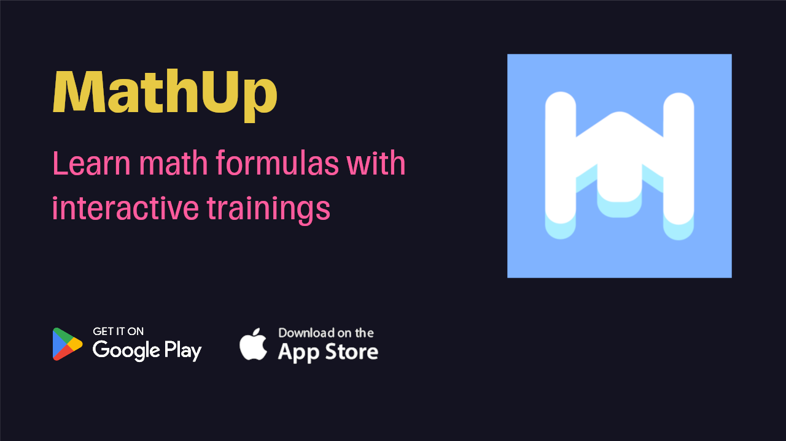
    </td>
  </tr>
  <tr>
    <td><a href="https://github.com/remgus/diary56x">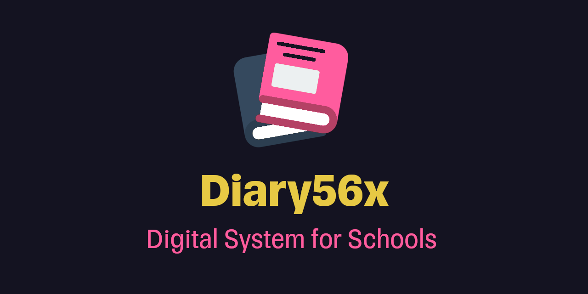</a></td>
    <td></td>
  </tr>
  <tr>
    <td>
      <a href="https://github.com/fm-projects/nto-ats-leaderboard">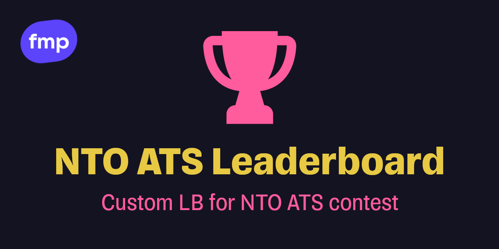</a>
    </td>
    <td>
      <a href="https://github.com/fm-projects/afishka">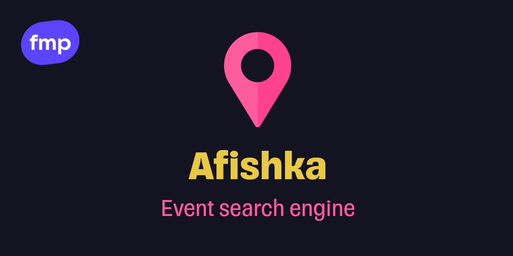</a>
    </td>
  </tr>
  <tr>
    <td>
      <a href="https://github.com/remgus/olymp">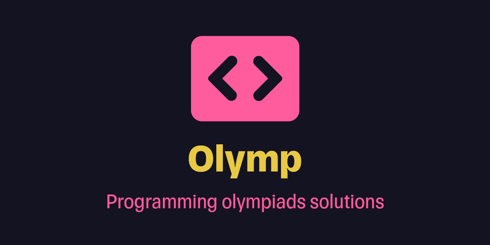</a>
    </td>
  </tr>
</table>

## 📊 Stats

<table>
  <tr>
    <td>
      
    </td>
    <td>
      
    </td>
  </tr>
</table>

## Certificates

<table>
  <tr>
    <td width="33.3%">
      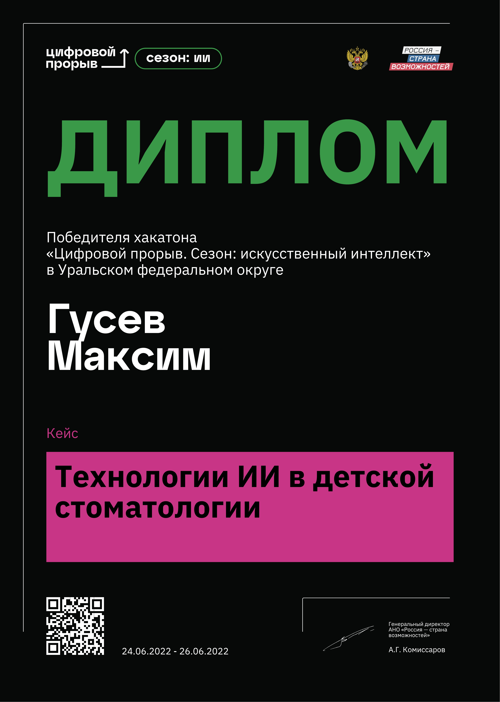
    </td>
    <td width="33.3%">
      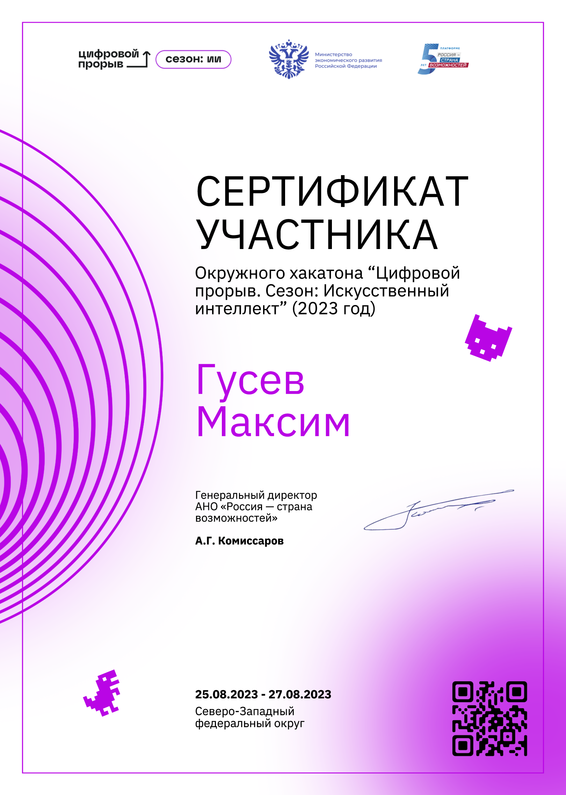
    </td>
    <td width="33.3%">
      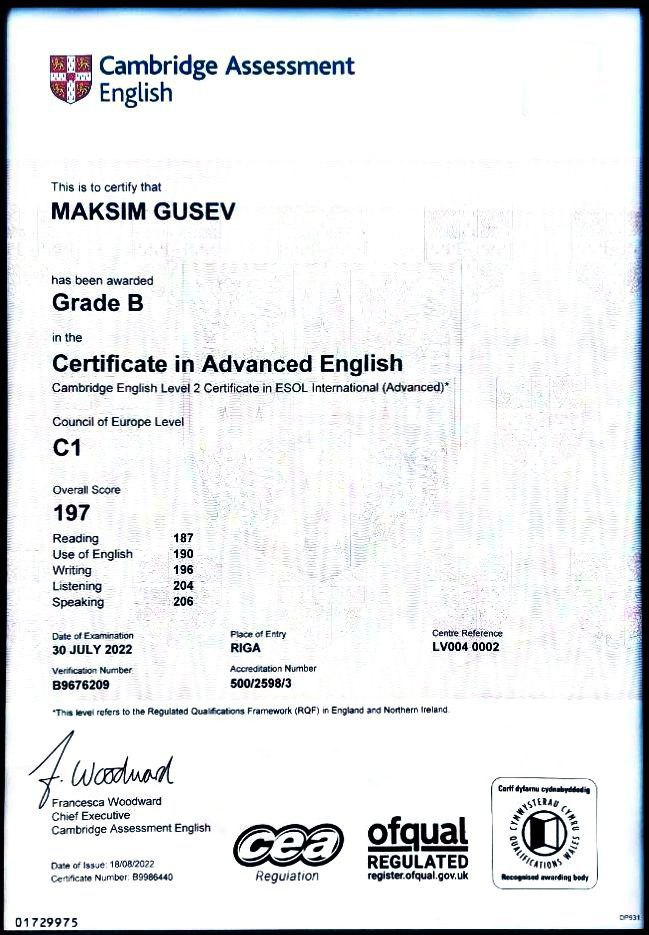
    </td>
  </tr>
  <tr>
    <td width="33.3%">
     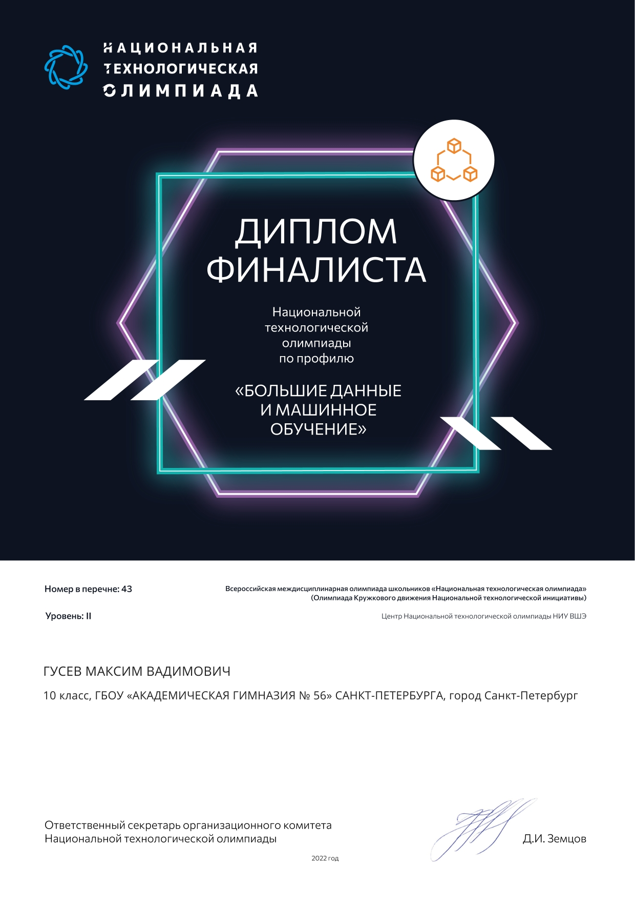
    </td>
    <td width="33.3%">
     
    </td>
    <td width="33.3%">
     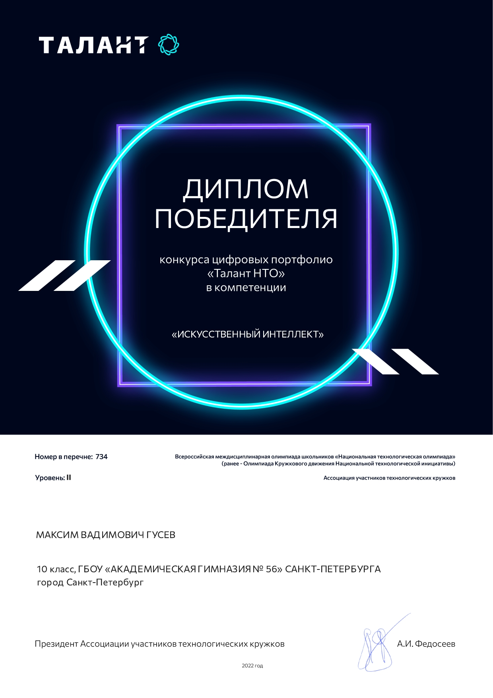
    </td>
  </tr>
  <tr>
    <td width="33.3%">
      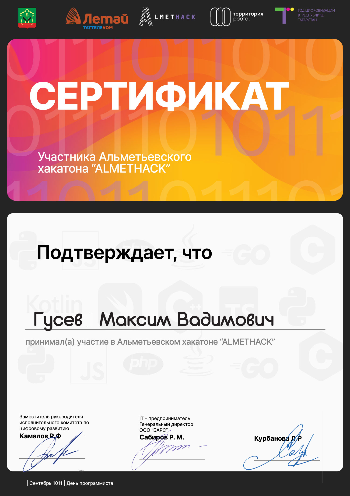
    </td>
    <td width="33.3%">
     
    </td>
  </tr>
</table>
